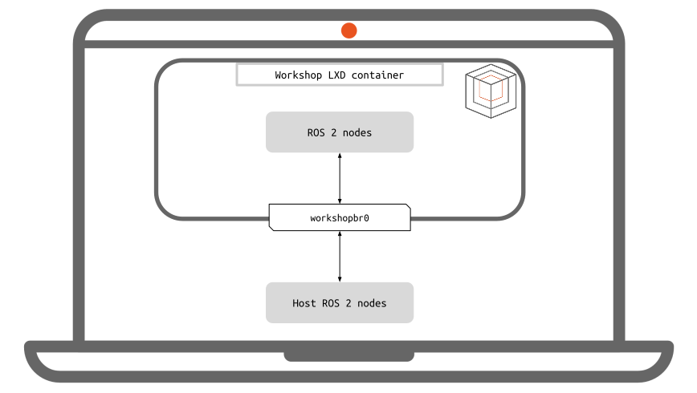
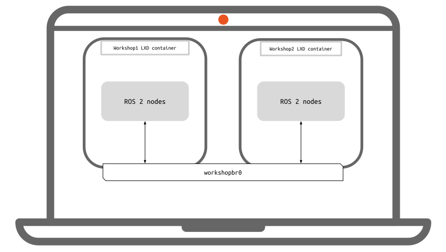
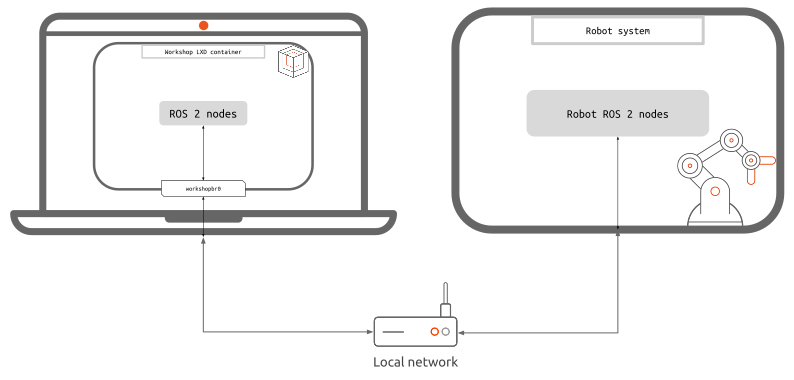

# ROS 2 networking with Workshop

The Workshop container connects to the `workshopbr0` managed bridge,
which provides NAT-based outbound connectivity.
This affects ROS 2 discovery and data exchange differently
depending on where the other ROS 2 nodes run.

This guide covers three cases:

- [Workshop to its host](#workshop-to-host)
- [Workshop to another workshop](#workshop-to-workshop)
- [Workshop to a robot on the host's LAN](#workshop-to-robot)

This guide covers Fast DDS through `rmw_fastrtps_cpp`,
the default RMW implementation in the ROS 2 SDK,
and `rmw_zenoh_cpp`, its most common RMW implementation alternative.

```{important}
The ROS 2 daemon keeps the RMW implementation and networking configuration with
which it was started.

Run `ros2 daemon stop` on every affected machine and in
every affected workshop **before** changing `RMW_IMPLEMENTATION`,
`ROS_DOMAIN_ID`, `ROS_DISCOVERY_SERVER`, `ZENOH_CONFIG_OVERRIDE`, or another
discovery setting.
Otherwise,

commands such as `ros2 node list` and `ros2 topic list` may return a
stale or empty graph even when nodes can exchange data.
```

## Workshop to host

Nodes in a workshop can communicate with ROS 2 nodes on its host without additional
configuration.



`````{tab-set}
````{tab-item} Fast DDS (default)

Use Fast DDS and the same ROS domain on both sides:

```bash
# Run on both the host and in the workshop.
ros2 daemon stop
```

Start a publisher on the host:

```bash
ros2 topic pub /workshop_test std_msgs/msg/Int32 '{data: 123}'
```

Subscribe in the workshop:

```bash
ros2 topic echo /workshop_test std_msgs/msg/Int32
```

Swap publisher and subscriber to verify both directions.
````

````{tab-item} Zenoh

Install and select `rmw_zenoh_cpp` on the host and in the workshop.
Enable peer discovery because the default ROS Zenoh configuration
disables multicast scouting:

```bash
# Run on both the host and in the workshop.
ros2 daemon stop
export RMW_IMPLEMENTATION=rmw_zenoh_cpp
export ZENOH_ROUTER_CHECK_ATTEMPTS=-1
export ZENOH_CONFIG_OVERRIDE='listen/endpoints=["tcp/0.0.0.0:0"];scouting/multicast/enabled=true'
```

Use the same configuration on both sides, then test:

```bash
# Host
ros2 topic pub /workshop_test std_msgs/msg/Int32 '{data: 123}'

# Workshop
ros2 topic echo /workshop_test std_msgs/msg/Int32
```

Swap publisher and subscriber to verify both directions.
````
`````

## Workshop to workshop

Workshops on the same host use the same Workshop bridge and can address each
other by hostname.



Run `workshop info` to find a workshop's hostname:

```text
hostname:  demos-jazzy-dev.workshop-tutorial.wp
```

With `demos-jazzy-dev` the workshop name and `workshop-tutorial` the
project directory name.

`````{tab-set}
````{tab-item} Fast DDS (default)

Use Fast DDS and the same ROS domain in both workshops:

```bash
# Run on both workshops.
ros2 daemon stop
```

Fast DDS multicast discovery and ROS 2 communication work without an additional
route. Verify with an explicit type:

```bash
# Workshop 1
ros2 topic pub /workshop_test std_msgs/msg/Int32 '{data: 123}'

# Workshop 2
ros2 topic echo /workshop_test std_msgs/msg/Int32
```

Swap publisher and subscriber to verify both directions.
````

````{tab-item} Zenoh

Configure both workshops as Zenoh peers with multicast scouting enabled:

```bash
# Run on both workshops.
ros2 daemon stop
export RMW_IMPLEMENTATION=rmw_zenoh_cpp
export ZENOH_ROUTER_CHECK_ATTEMPTS=-1
export ZENOH_CONFIG_OVERRIDE='listen/endpoints=["tcp/0.0.0.0:0"];scouting/multicast/enabled=true'
```

Then test:

```bash
# Workshop 1
ros2 topic pub /workshop_test std_msgs/msg/Int32 '{data: 123}'

# Workshop 2
ros2 topic echo /workshop_test std_msgs/msg/Int32
```

Swap publisher and subscriber to verify both directions.
````
`````

## Workshop to robot

The robot is on the same LAN as the Workshop host,
but the workshop itself is behind the `workshopbr0` bridge.



Outbound workshop connections work,
while the robot cannot initiate a connection to the workshop's private address
without an explicit route or a data relay.

```{note}
Using Zenoh client mode with `rmw_zenoh_cpp` is recommended.
It is the simplest configuration.

Use DDS Router when the robot and workshop nodes must remain on Fast DDS.
```

```````{tab-set}
``````{tab-item} Fast DDS (default)

`````{tab-set}
````{tab-item} Without IP routes (recommended for Fast DDS)

[Fast DDS Discovery Server](https://fast-dds.docs.eprosima.com/en/latest/fastdds/discovery/discovery_server.html)
helps with discovery only.
it does not transport user data and won't help establishing a connection to the `workshopbr0`.

Here we need an [eProsima DDS Router](https://eprosima-dds-router.readthedocs.io/en/latest/rst/formalia/titlepage.html#overview)
instance on both the robot and the workshop to relay ROS 2 traffic in both directions.

Install the router on the robot and in the workshop:

```bash
sudo snap install vulcanexus-router --channel=jazzy/edge
```

On the robot, create `router.yaml`:

```yaml
version: v4.0
specs:
  discovery-trigger: any
allowlist:
  - name: "*"
    type: "*"
participants:
  - name: robot_local
    kind: local
    domain: 0 # matches the ROS_DOMAIN_ID
    transport: udp
  - name: robot_wan
    kind: wan
    listening-addresses:
      - ip: 0.0.0.0
        port: 11666
        transport: tcp
```

Then start the router:

```bash
vulcanexus-router -c router.yaml
```

In the workshop, create `/home/workshop/router.yaml`, replacing `ROBOT_IP` with the
robot's LAN IP address or resolvable hostname:

```yaml
version: v4.0
specs:
  discovery-trigger: any
allowlist:
  - name: "*"
    type: "*"
participants:
  - name: workshop_local
    kind: local
    domain: 0 # matches the ROS_DOMAIN_ID 
    transport: udp
  - name: to_robot
    kind: wan
    connection-addresses:
      - ip: ROBOT_IP # make sure to replace the value here
        port: 11666
        transport: tcp
```

Start the workshop router:

```bash
vulcanexus-router -c /home/workshop/router.yaml
```

Start both routers before starting the ROS 2 nodes. Test both directions:

```bash
# Workshop publisher
ros2 topic pub /robot_test std_msgs/msg/Int32 '{data: 123}'

# Robot subscriber
ros2 topic echo /robot_test std_msgs/msg/Int32
```

Then swap publisher and subscriber.

`discovery-trigger: any` is important. The default trigger is `reader`, which
does not relay a publisher-only topic until a subscriber is discovered on the
same side.

In case it doesn't work,
make sure the router is reachable from the other peer, example:
```bash
# from the Workshop
nc -zv ROBOT_IP 11666
```
````

````{tab-item} With IP routes

```{warning}
This strategy requires the robot to know the Workshop host address and workshop
subnet.
It also requires IP forwarding and forwarding-policy changes on the host.
Reconfigure the robot whenever a different host or workshop subnet is used.
```

First determine:

- `HOST_LAN_IP`: the Workshop host address reachable from the robot.
- `HOST_LAN_INTERFACE`: the host network interface reachable from the robtot.
- `WORKSHOP_IP`: the workshop's address on `workshopbr0`.
- `ROBOT_IP`: the robot's LAN address.

On the Workshop host, enable IPv4 forwarding:

```bash
sudo sysctl -w net.ipv4.ip_forward=1
```

In case you have Docker installed,
enable incoming traffic from the host network interface to the worlshop bridge:

```
sudo iptables -A FORWARD -i HOST_LAN_INTERFACE -o workshopbr0 -j ACCEPT
```

On the robot, route the workshop subnet through the Workshop host:

```bash
sudo ip route add WORKSHOP_IP via HOST_LAN_IP
ping WORKSHOP_IP
```

From the workshop, verify reachability to the robot:

```bash
ping ROBOT_IP
```

IP routing does not forward multicast discovery by default.
Configure explicit peers using the Fast DDS mechanism supported by your ROS 2 release:

```bash
# In the workshop
ros2 daemon stop
export ROS_STATIC_PEERS='ROBOT_IP'

# On the robot
ros2 daemon stop
export ROS_STATIC_PEERS='WORKSHOP_IP'
```

Note that `ROS_STATIC_PEERS` was introduced in Iron,
and is not compatible with prior ROS 2 version

Test both directions:

```bash
# Workshop publisher
ros2 topic pub /robot_test std_msgs/msg/Int32 '{data: 123}'

# Robot subscriber
ros2 topic echo /robot_test std_msgs/msg/Int32
```


````
`````
``````

``````{tab-item} Zenoh

`````{tab-set}
````{tab-item} Without IP routes (recommended and easiest)

This approach uses the Zenoh router as a data relay.
The workshop opens one outbound TCP session to the robot,
and traffic flows in both directions over that session.
No route, Workshop tunnel,
or workshop-side router is required.

Install `rmw_zenoh_cpp` for the relevant ROS 2 distribution on both sides.
Start the Zenoh router on the robot:

```bash
ros2 daemon stop
export RMW_IMPLEMENTATION=rmw_zenoh_cpp
ros2 run rmw_zenoh_cpp rmw_zenohd
```

All the robot's ROS 2 nodes must be running with the `RMW_IMPLEMENTATION=rmw_zenoh_cpp`.

In the workshop, replace `ROBOT_IP`, then configure client mode:

```bash
ros2 daemon stop
export RMW_IMPLEMENTATION=rmw_zenoh_cpp
export ZENOH_CONFIG_OVERRIDE='mode="client";connect/endpoints=["tcp/ROBOT_IP:7447"]'
```

Test both directions:

```bash
# Workshop publisher
ros2 topic pub /robot_test std_msgs/msg/Int32 '{data: 123}'

# Robot subscriber
ros2 topic echo /robot_test std_msgs/msg/Int32
```

Then swap publisher and subscriber.

All participating nodes must use `rmw_zenoh_cpp`. A Fast DDS node cannot
communicate through this `rmw_zenoh` router setup.

In case it doesn't work,
make sure the router is reachable from the other peer, example:
```bash
# from the Workshop
nc -zv ROBOT_IP 7447
```
````

````{tab-item} With IP routes

```{warning}
This strategy requires the robot to know the Workshop host address and workshop
subnet.
Prefer Zenoh client mode without routes unless direct peer connectivity is specifically required.
```

First determine:

- `HOST_LAN_IP`: the Workshop host address reachable from the robot.
- `WORKSHOP_IP`: the workshop's address on `workshopbr0`.
- `ROBOT_IP`: the robot's LAN address.

On the Workshop host, enable IPv4 forwarding:

```bash
sudo sysctl -w net.ipv4.ip_forward=1
```

In case you have Docker installed,
enable incoming traffic from the host network interface to the worlshop bridge:

```
sudo iptables -A FORWARD -i HOST_LAN_INTERFACE -o workshopbr0 -j ACCEPT
```


On the robot, route the workshop subnet through the Workshop host:

```bash
sudo ip route add WORKSHOP_IP via HOST_LAN_IP
ping WORKSHOP_IP
```

From the workshop, verify reachability to the robot:

```bash
ping ROBOT_IP
```

Use an explicit,
fixed Zenoh peer endpoint because IP routing does not forward multicast scouting by default.
In the workshop:

```bash
ros2 daemon stop
export RMW_IMPLEMENTATION=rmw_zenoh_cpp
export ZENOH_CONFIG_OVERRIDE='mode="peer";listen/endpoints=["tcp/0.0.0.0:7448"];scouting/multicast/enabled=false'
```

On the robot,
connect to the workshop peer:

```bash
ros2 daemon stop
export RMW_IMPLEMENTATION=rmw_zenoh_cpp
export ZENOH_CONFIG_OVERRIDE='mode="peer";connect/endpoints=["tcp/WORKSHOP_IP:7448"];scouting/multicast/enabled=false'
```

Test both directions:

```bash
# Workshop publisher
ros2 topic pub /robot_test std_msgs/msg/Int32 '{data: 123}'

# Robot subscriber
ros2 topic echo /robot_test std_msgs/msg/Int32
```
````
`````
``````
```````

## Troubleshooting

### ROS 2 CLI returns an empty or stale graph

Stop the ROS 2 daemon before every middleware or discovery configuration change.
If a CLI command restarted it while changing settings,
stop it again before inspecting the graph:

```bash
ros2 daemon stop
ros2 topic list --no-daemon
ros2 node list --no-daemon
```

The daemon inherits `RMW_IMPLEMENTATION`, `ROS_DOMAIN_ID`, and middleware
configuration from the environment in which it starts.

### Fast DDS and Zenoh settings are mixed

Stop the daemon, then clear middleware-specific settings before changing
approaches:

```bash
ros2 daemon stop
unset RMW_IMPLEMENTATION ROS_DOMAIN_ID
unset ROS_DISCOVERY_SERVER FASTDDS_DEFAULT_PROFILES_FILE
unset FASTRTPS_DEFAULT_PROFILES_FILE FASTDDS_BUILTIN_TRANSPORTS
unset ZENOH_CONFIG_OVERRIDE ZENOH_SESSION_CONFIG_URI
```

Set only the variables required by the selected tab before launching nodes or
using ROS 2 CLI commands.
