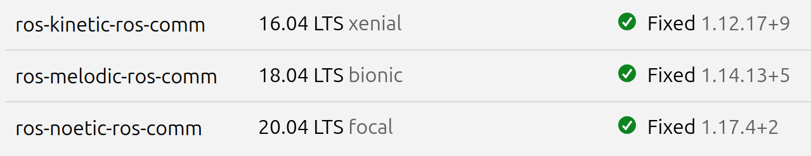

# Check if a CVE is fixed in your environment

If you're running ROS in production, it's important to know whether a specific CVE
has been patched in your environment.

You can find detailed step-by-step instructions to
[check if your system is affected by a CVE](https://documentation.ubuntu.com/pro-client/en/latest/howtoguides/fix_how_to_know_if_system_affected_by_cve/),
and to [resolve a specific CVE](https://documentation.ubuntu.com/pro-client/en/latest/howtoguides/fix_how_to_resolve_given_cve/)
in the Ubuntu Pro Client documentation.

## 1. Get more details on the CVE

Go to the [Ubuntu CVE Tracker website](https://ubuntu.com/security/cves)
and search for the CVE ID, for example: `CVE-2025-3753`.
You'll find details about the vulnerability, including:

- Affected packages
- Impacted Ubuntu releases
- Fix status (e.g., Released, Needed, Not affected)
- Links to the associated public CVE entries in the NVD database

## 2. Find the fixed version

Look for the version number where the fix was released.
Make a note of the package name and the patched version for your ROS ESM release.
For example, you will find [CVE-2025-3753](https://ubuntu.com/security/CVE-2025-3753),
affecting the `ros-comm` package has been fixed for ROS ESM Noetic from version `1.17.4+2`:



## 3. Check fix status in your system

If you're using **Ubuntu Pro with ROS ESM**,
first make sure security updates are enabled:

```bash
pro status
```

You can use the Ubuntu Pro Client tool to check if your system is affected
by running:

```bash
pro fix --dry-run CVE-2025-3753
```

The output of the dry run will also indicate whether if a fix is available,
without actually applying it.

## 4. Update if needed

Finally, use the `pro fix` command to apply the needed fix to your system:

```bash
pro fix CVE-2020-25686
```

This command will:

- describe the CVE/USN;
- display the affected packages;
- fix the affected packages; and
- show if the CVE/USN is fully fixed in the machine.

This quick check helps you confirm whether potentially critical vulnerabilities
have been addressed in your ROS-based systems.

If you still **need to enable Ubuntu Pro and ROS ESM**, check out our [step-by-step guide](enable-ros-esm.md).
