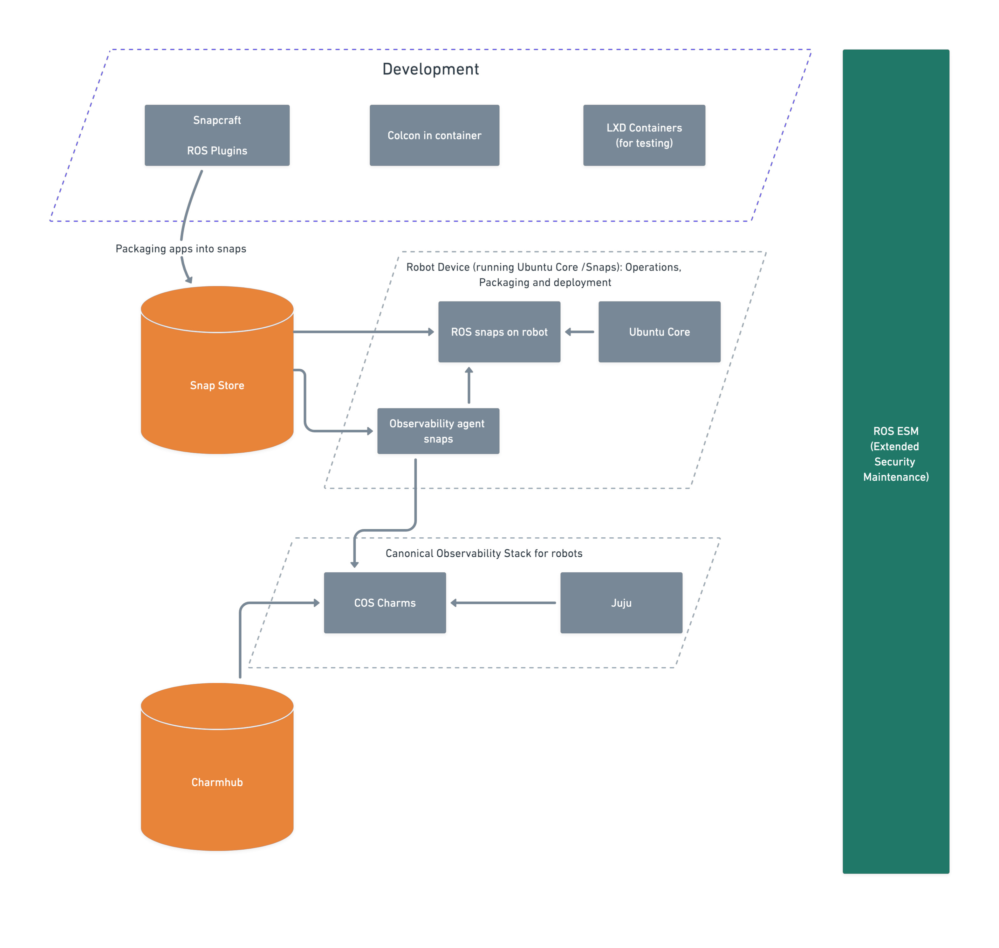

# Robotics reference architecture

% Include start summary

This page outlines the reference architecture of the Canonical robotics stack,
detailing the essential components and their roles across development, deployment,
and observability phases of a robot development.

% Include stop summary

```{note}
This document is intended for developers and engineers working with
the Canonical robotics stack, including those involved in the development,
packaging, deployment and observability of ROS snap applications.
It provides a **high-level overview** of the architecture and its components,
serving as a guide for understanding how they interact within the ecosystem.
```

## Canonical Robotics Stack Overview



The Canonical robotics stack streamlines the lifecycle of
robotics applications through the following key phases:

1. **Development and Packaging**: Developers use Snapcraft to create and
  package robotics applications into secure, portable snaps,
  tested in isolated LXD containers.
2. **Distribution**: Packaged snaps are uploaded to the Snap Store,
  serving as the central repository for robot devices and observability systems.
3. **Deployment and Operations**: Applications and observability agents run on
  Ubuntu Core-based robot devices,
  ensuring a reliable and secure runtime environment.
4. **Observability and Monitoring**: The Canonical Observability Stack (COS),
  managed by Juju, collects and visualizes performance data from robots,
  enabling effective monitoring and troubleshooting.

### Development Phase

- **Snapcraft**: The tool used to package applications into snaps.
  Developers use it to create confined, secure, and portable packages.
    > Get started with [Snapcraft tutorials for packaging and distributing ROS snap applications](/tutorials/snaps-core/index.rst)
- **[LXD Containers](https://documentation.ubuntu.com/lxd/en/stable-5.21/)**:
  Lightweight containers used to test applications in
  isolated environments before deployment.
- **[Colcon in-container](https://github.com/canonical/colcon-in-container)**:
  `colcon` extension to build,
  test and release inside a fresh and
  isolated ROS environment and transfer the results back to the host.

### Packaging and Publishing

- **[Snap Store](https://snapcraft.io/docs)**:
  The centralized repository for distributing snaps.
  Once your ROS apps are [packaged with Snapcraft](/tutorials/snaps-core/packaging-ros-application-as-snap.md),
  they are uploaded here.
  This store serves both the robot devices and the observability stack.

### Robot Device (Running Ubuntu Core)

- **[Ubuntu Core](https://ubuntu.com/core/docs)**: A minimal,
  immutable version of Ubuntu tailored for embedded and IoT devices.
  It serves as the base OS on the robot.
- **ROS Snaps**: Applications and libraries using the Robot Operating System (ROS),
  delivered as snaps and running directly on the robot.
- **[Observability Agent Snaps](../../tutorials/observability/index.md)**:
  Monitoring agents also packaged as snaps,
  deployed on the robot to collect metrics and logs for observability.

### Canonical Observability Stack (COS)

```{important}
We have implemented an observability stack ({{COS_ROB}})
purposefully for ROS snap applications.
- Tutorials can be found in the [observability section](../../tutorials/observability/index.md).
- How-to guides for customization can be found in the [{{COS_ROB}} section](../../how-to-guides/operation/write-configuration-snap-for-cos-for-robotics.md).
```

- **[COS Lite](https://charmhub.io/topics/canonical-observability-stack/editions/lite)**:
  A set of Juju-managed applications (charms) that provide metrics, logging,
  and tracing capabilities.
  It collects and displays data from observability agents running on robots.
- **[Juju](https://documentation.ubuntu.com/juju/3.6/)**:
  The orchestration engine used to deploy and manage the COS services.
- **COS Charms**: Deployed from [Charmhub](https://charmhub.io/cos-lite),
  these include components like [Prometheus](https://charmhub.io/prometheus-k8s),
  [Loki](https://charmhub.io/loki-k8s) and [Grafana](https://charmhub.io/grafana-k8s).
  They are deployed on a Kubernetes (k8s) cluster to
  provide observability infrastructure.

## Summary of the entire workflow

1. Developers write and package applications using Snapcraft.
2. The snaps are uploaded to the Snap Store.
3. The robot devices fetch ROS snaps and observability agents from the Snap Store.
4. Observability data is sent to the COS Server,
   which is deployed via charms from Charmhub.
5. Juju orchestrates and manages both the robot-side observability agents and
   the COS backend services.

## Conclusion

This stack ensures a fully integrated workflow for development, deployment,
and monitoring of robotics applications,
leveraging Canonical's ecosystem of snaps, Juju, and Ubuntu Core.
