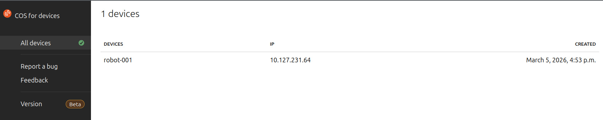
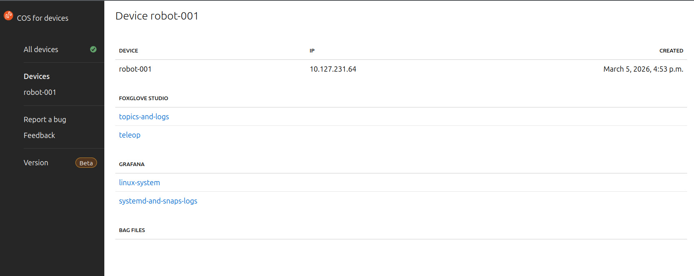

# Deploy {{ COS_ROB }} agent on your robot

```{warning}
**Beta Notice**: {{COS_ROB}} is currently in `beta`.
Content and features may change,
and some functionality may be incomplete or experimental.
Feedback is welcome as we continue to improve.
```

## Overview

**Requirements**:
Before starting this tutorial, make sure to have the server side working
[from the previous tutorial](./deploy-cos-for-robotics-server-in-the-cloud.md)

In order for a device to register and
interact with the COS registration server and
its applications the following snaps have to be installed:

- [`rob-cos-demo-configuration`](https://snapcraft.io/rob-cos-demo-configuration):
  contains the configuration of the robot.
- [`cos-registration-agent`](https://snapcraft.io/cos-registration-agent):
  responsible for registering the robot on the [`COS-registration-server`](https://charmhub.io/cos-registration-server-k8s)
  as well as uploading robot specific data to the server
  (dashboard, foxglove layouts, `UID`, etc).
- [`ros2-exporter-agent`](https://snapcraft.io/ros2-exporter-agent):
  responsible for recording data on the robot and
  syncing them to the [`Ros2BagFileserver`](https://charmhub.io/ros2bag-fileserver-k8s).
- [`grafana-agent`](https://snapcraft.io/grafana-agent):
  responsible for sending metrics, logs, and trace data to the Grafana charm.
- [`foxglove-bridge`](https://snapcraft.io/foxglove-bridge):
  bridge to visualize live ROS data via the Foxglove websocket connection.
- [`rob-cos-data-sharing`](https://snapcraft.io/rob-cos-data-sharing):
  data sharing snap for on device cos robotics snaps.

## Verify connectivity

Before diving into the device setup,
let’s ensure that the device can reach the server on the network.
To connect devices across different networks, a VPN between the robots and
the server could be used but is not mandatory.
Let’s do so by initiating a `curl` from the device to the server:

```bash
curl http://<cos-robotics-server-ip>/cos-robotics-model-cos-registration-server/api/v1/health
```

If the command returns without errors, connectivity is correct.

Make sure the request works from the device to the server,
otherwise the rest of the guide cannot be executed.
Now it’s time to set up and register the device!

### Installation

A convenience script has been created to install all the required snaps on the device.
Download the script as follows:

```bash
curl -L https://raw.githubusercontent.com/canonical/rob-cos-device-setup/track/0/setup-robcos-device.sh -O
```

And run it with:

```bash
sudo bash setup-robcos-device.sh
```

The script will initiate prompts for the robot `UID` and the server URL.
While the robot `UID` is optional, the URL is mandatory,
serving as the designated address for the server
where the device registration occurs.
The queries and response will look as follows:

```bash
Please enter the device-uid:
robot_1
```

```console
Please enter the rob-cos-server-url:
http://<cos-robotics-server-ip>/cos-robotics-model
```

The script will now proceed with the installation of all the required snaps.
Upon completion,
the device and its corresponding dashboards will be registered and
available for visualization on the {{ COS_ROB }} server.

## Verify Installation

Now let’s verify that the device has been correctly configured and registered.
On the browser, access the catalogue and click on the COS-registration-server app.
The registered robot should be now available in the devices list:



By clicking on the robot `UID`, a page will open,
displaying all the links to the robot's data:



From this page,
each link will redirect you to the corresponding dashboard for
the specific data category and device,
ensuring easy and intuitive visualization.

An example visualization of Grafana linux-system dashboard is provided below:


This is it,
now your device is registered and being correctly monitored via {{ COS_ROB }}!

If you want to start storing ROS 2 bags, check the following How-to guide:
- [Host a basic file server for your rosbags](../../how-to-guides/operation/deploy-caddy.md)
